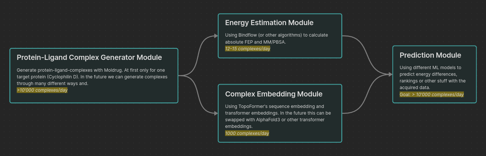

# Enerplex

**Enerplex** serves as the core data storage and access hub for the project, enabling seamless integration and management of protein-ligand complex (PLC) datasets. It is composed of three primary components:

---

### 📂 Enerplex Database
The **Enerplex Database** is a MySQL-based system that stores and organizes data generated by the pipeline. It efficiently manages:
- **Protein-ligand complex (PLC) information**
- **Transformer-based embeddings**
- **Free energy calculations** (e.g., AFEP, MM/XBSA)

---

### 🖧 Enerplex API 
The **Enerplex API** is a Node.js Express-based interface that bridges the Enerplex Database and downstream tools. It provides CRUD operations to:
- Access, update, and manage PLC data
- Retrieve embeddings and energy calculations
- Integrate seamlessly with modular pipelines

---

### 🐍 Enerplex API Client 
The **Enerplex API Client** is a Python package for programmatic interaction with the Enerplex API. It simplifies:
- Authentication and token management
- Protein, ligand, and embedding retrieval
- Data upload and file management


# Energen



**Energen** is a modular pipeline designed to generate, process, and evaluate protein-ligand complexes for dataset creation and analysis. The pipeline consists of the following stages:

---

### 🧬 Protein-Ligand Complex Generator Stage
This stage generates protein-ligand complexes (PLCs) and prepares them for downstream tasks:
- **Protein Targets:** Initially focused on CyclophilinD, with extensibility for other targets.
- **Ligand Generation:** Utilizes **Moldrug**, a genetic algorithm-based tool, to create and grow novel ligands.
- **Scoring:** Calculates docking scores for ligands, with potential for AlphaFold3 integration to improve binding pose accuracy.

---

### 🔗 Feature Embedding Stage
The embedding stage transforms PLC data into high-dimensional vector representations for downstream tasks:
- **Non-ML Topological Sequence Embedding:** Extracts sequence features from structural data.
- **TopoFormer Encoder:** Applies a pre-trained transformer model to produce rich vector embeddings.
- **Output:** Embeddings are stored in the Enerplex Database for further analysis.

---

### ⚡ Energy Calculation Stage
This stage calculates free binding energies to assess ligand viability:
- **Bindflow:** Performs energy calculations using:
  - **Absolute Free Energy Perturbation (AFEP):** For highly precise energy values.
  - **MM/GBSA (or MM/PBSA):** For computationally efficient energy estimations.
- **Optimizations:** Reduces computational overhead through batch processing and validate-train workflows.
- **Output:** Energy results are saved to the Enerplex Database.

---

### 🔮 Predicting Stage (Under Development)
This upcoming stage aims to predict binding efficiencies and other key properties using machine learning models. It will leverage embeddings and calculated energies to enhance predictive accuracy.


# Installation and Usage

### 🛠️ Installation
Clone the full **Enerplex & Energen** project with all submodules updated to the latest version with
```bash
git clone --recurse-submodules --remote-submodules git@github.com:NoxelS/energen.git
```

If you just want to clone them at their recorded SHA1:
```bash
git clone --recurse-submodules git@github.com:NoxelS/energen.git

```

### ⚙️ Setup
Consult individual stage or repository guides for further installation and setup instructions.